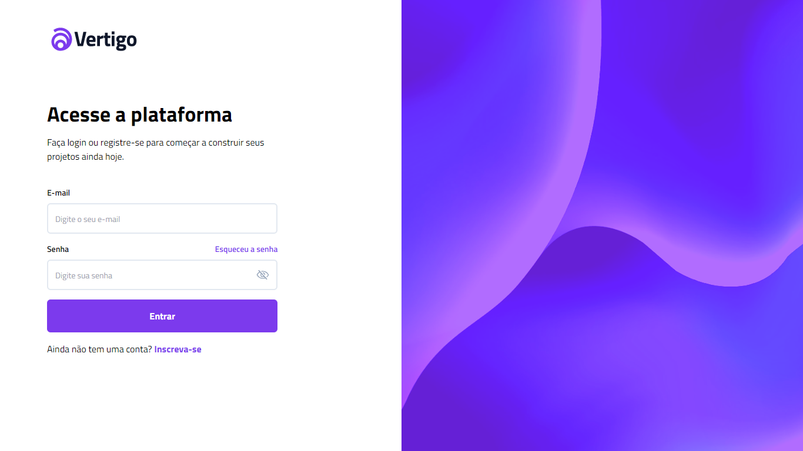

<h1 align="center"> Vertigo - Desafio 11 </h1>

Desafios exclusivos, promovido pela Rockeseat.  

  

 

  <h3 align='center'>Web</h3>
  

## Status

 - Em desenvolvimento 🛑

## 👨🏼‍💻 Funções

 - Estilos diferentes para um mesmo componente (Input e Button) através das propriedades atribuídas com Styled-Components

## 🚀 Tecnologias

Esse projeto foi desenvolvido com as seguintes tecnologias:

- React
- Typescript
- Tailwindcss
- Styled Components
- Phosphor React
- Git e Github

## 💻 Projeto

Este projeto é o desafio 11 dos challengers semanais da Rocketseat #boraCodar

- [Acesse o projeto finalizado, online](https://vertigo-bora-codar.vercel.app)

## 🔖 Layout

Você pode visualizar o layout do projeto através [DESSE LINK](https://www.figma.com/file/b3cZ6HYtGVk8u6dVLs6bXe/%23boracodar---Desafio-11-(Community)) para acessá-lo.

## :memo: Licença

Esse projeto está sob a licença MIT.
